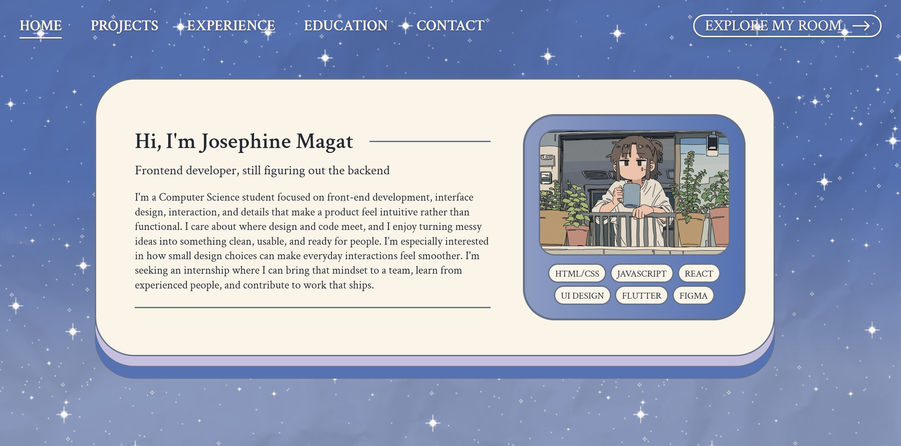

# Avys Portfolio

Avys Portfolio is an interactive website that brings together professional work and personal interests. It has two sides: a professional portfolio featuring projects, experience, education, and certificates, and an illustrated personal room where visitors can explore collections of shows, stories, games, and music.

**Live site:** [Visit Avys Portfolio](https://jsphnmgt.github.io/avys-portfolio/)

**Demo video:** [Watch the demo](https://drive.google.com/drive/folders/1B3oj6ORSq4x1khLnwtaZtEFo4iStCV-e?usp=sharing)



## What it does

### Explore my work

The professional side introduces my background and the digital experiences I’ve helped build.

- **Projects:** browse my work and click a card to see its preview, description, technologies, and GitHub link when available.
- **Experience and education:** learn about my academic background and experience.
- **Certificates:** explore my achievements, view certificate images, and follow available credential links.
- **Contact:** find my email, GitHub, and LinkedIn if you’d like to connect.

Use the navigation at the top to move between sections. When you’re ready to see the personal side, click **Explore my room**.

### Step into my room

The personal room is an illustrated space filled with objects you can explore. Click the glowing objects or use **Explore Room** to open a collection.

| Inside the room | What you’ll find |
| --- | --- |
| **Personal Computer** | A desktop-inspired file explorer with a welcome message, an introduction to me, and brief Favorites and Currents summaries. Click a summary to visit its full collection. |
| **Watchlist** | My favorite shows and movies, what I’m currently watching, and titles I’ve watched, with covers and personal ratings. |
| **Reading List** | Favorite WEBTOON stories, current reads, and finished titles, with authors and ratings. |
| **Game Shelf** | My favorite games, what I’m currently playing, and an alphabetical collection presented as game cartridges. |
| **Music Corner** | Favorite songs, playlists, genres, and artists, with Spotify players for songs and playlists. |

Click a Watchlist, Reading List, or Game Shelf card to open its details. In the Game Shelf, use the DS buttons to switch between the games I’m currently playing.

In the Music Corner, clicking a song or playlist moves its card to the top and reveals a Spotify player underneath. Click the card again or its **X** button to close the player. Artist cards open their Spotify profiles.

Use **Back to portfolio** whenever you want to return to my work.

The interface includes responsive layouts, keyboard navigation, and reduced-motion alternatives.

## Built with

- **Frontend:** React 18, Vite 6, CSS
- **Design:** Figma, Google Fonts
- **Integration:** Spotify embeds
- **Deployment:** GitHub Actions, GitHub Pages

## Running it yourself

Install Node.js 20 or later and npm, then run:

```sh
cd client
npm ci
npm run dev
```

Open the URL printed by Vite, usually `http://localhost:5173`.

To build and preview the production version from the same folder:

```sh
npm run build
npm run preview
```

No database, API server, or environment file is required. The build output is written to `client/dist/`.

## Deploying

The workflow in [.github/workflows/deploy-pages.yml](.github/workflows/deploy-pages.yml) builds the client and publishes it to GitHub Pages.

The workflow sets `VITE_BASE_PATH` to the repository path, currently `/avys-portfolio/`, so assets load correctly on GitHub Pages. Locally, it defaults to `/`.

1. Set **Settings → Pages → Build and deployment → Source** to **GitHub Actions**.
2. Push changes under `client/` or changes to the deployment workflow to `main`.
3. Check the run in **Actions** and open the deployment URL.

The workflow can also be started manually with **Run workflow**. README-only changes do not trigger a deployment, and the current workflow skips publishing for private repositories. The build copies `index.html` to `404.html` as a fallback for unmatched paths.

## Project structure

```text
client/
  src/
    App.jsx                       Switches between portfolio and room
    main.jsx                      React entry point
    styles.css                    Shared design variables and styles
    assets/                       Images, covers, and SVG assets
    components/
      ProfessionalSide/           Portfolio sections and detail overlays
      PersonalSide/
        sections/Room.jsx         Interactive room page
        overlays/                 PC and personal collection overlays
  vite.config.js                  Vite configuration
scripts/                          Cover and collection metadata helpers
.github/workflows/                GitHub Pages deployment
docs/                             Planning and project documentation
AI-USAGE.md                       Detailed AI assistance record
```

Watchlist, reading, and game details are maintained in the JSON files under the personal overlays folder. Game selections and music collections live in their respective components, and the PC summaries draw from those collections. See [docs/README.md](docs/README.md) for the project documents.

## Architecture

Avys Portfolio is a static React application hosted on GitHub Pages. The URL hash switches between the professional portfolio and the personal room, while React state controls folders, overlays, and music tabs. Collection content is stored in local JSON files and component data; Spotify players load from Spotify when selected. There is no separate application server or database.

## What I would do next

- Fill in the remaining personal review placeholders.
- Test the full experience on more screen sizes and with keyboard-only navigation.
- Add new projects and keep the personal collections up to date.

## Author

**[Maria Josephine M. Magat (Josie)](https://github.com/jsphnmgt)**

**Course:** 6APSI · **Section:** CS-404

## AI use


I used Claude for early project structure and OpenAI Codex for substantial help with implementation, styling, animation, and debugging, guided by my designs, content, and feedback. See [AI-USAGE.md](AI-USAGE.md) for the detailed record.

## Licence

The project code is licensed under the [MIT License](LICENSE), with copyright attributed to Maria Josephine M. Magat. Third-party artwork and media belong to their respective owners.
