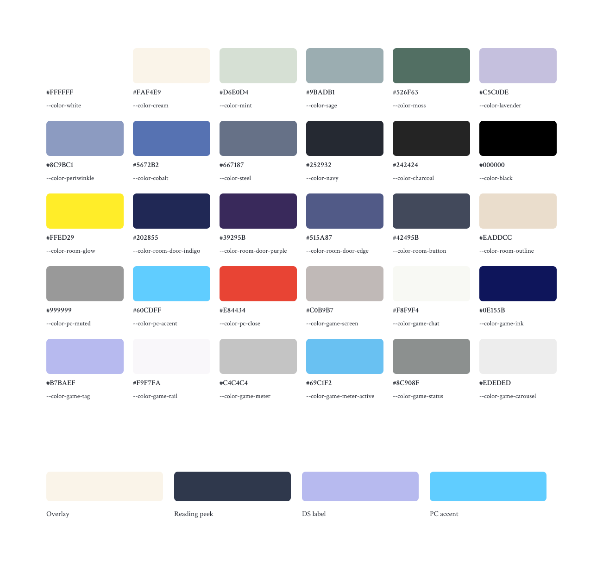
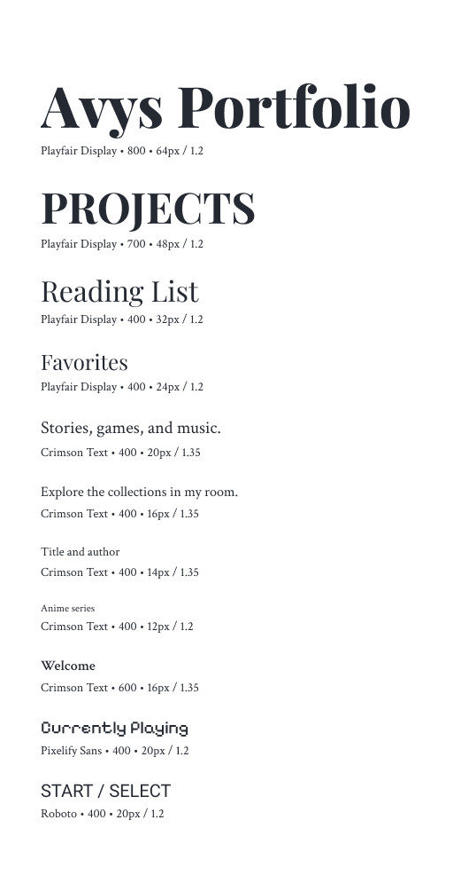
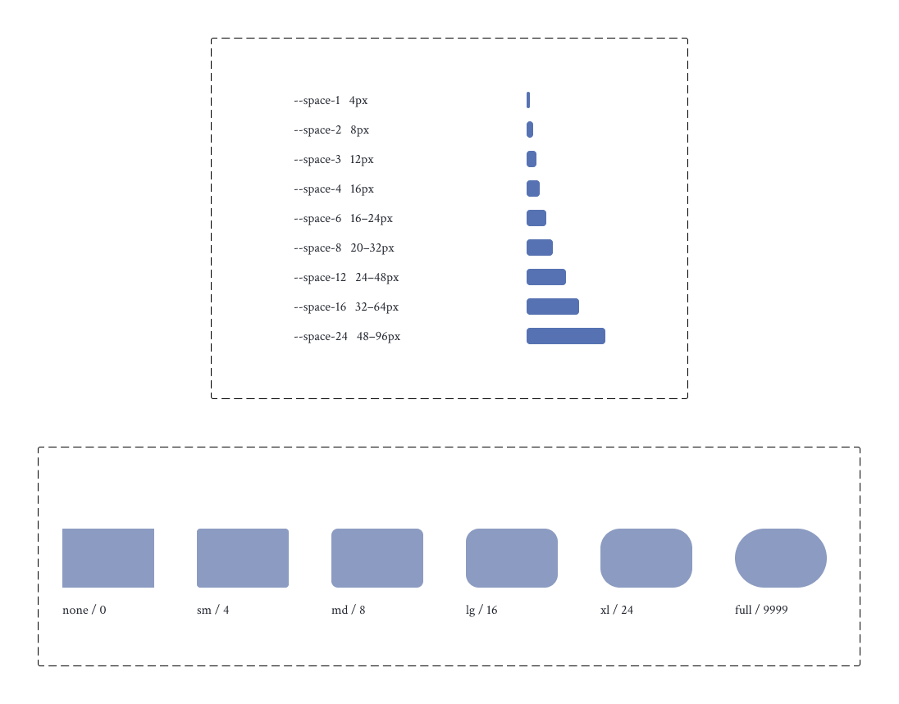
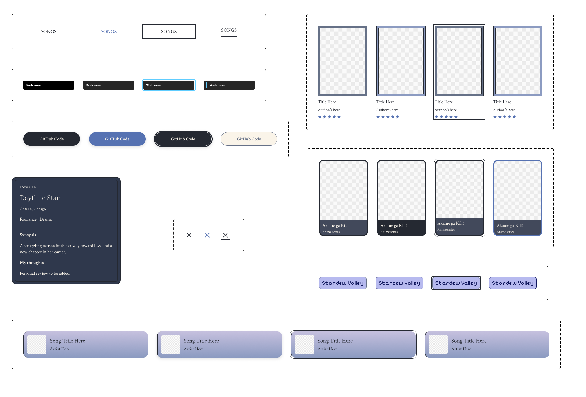
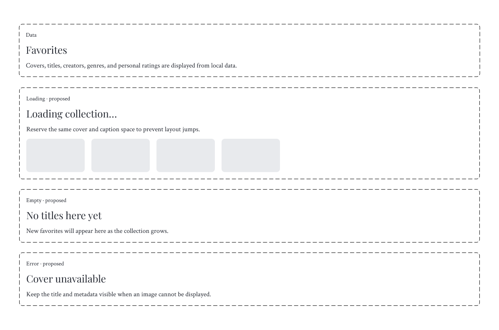

# Avys Portfolio — Design system

The design system records the colors, typography, spacing, components, and interaction states used by Avys Portfolio, based on the current CSS and collection components.

**[Open the design system in Figma](https://www.figma.com/design/j1jBpmx2Pb1JpV6k6GJIGV/APSI--final-project-?node-id=491-2)**

The seven updated sheets are on the **Design System** page, to the right of the original reference sections. Reusable master components sit separately from the examples.

## Colors

The palette contains 30 base colors, semantic aliases, and derived colors for the collection peek and PC selection. Figma variables use the corresponding CSS names and `var(--token)` code syntax.

Cream is the main overlay surface, navy is the main text color, and steel defines borders. Lavender, periwinkle, and cobalt form the blue accent palette. Mint, sage, and moss support the professional portfolio’s green sections. The DS uses a separate lavender tag and dark blue ink.

### Contrast

| Foreground / background | Ratio |
| --- | --- |
| Navy / cream | 13.30:1 |
| Cream / room button | 8.21:1 |
| Game ink / game tag | 8.84:1 |
| Cobalt / cream | 4.31:1 |

Cobalt on cream falls below the 4.5:1 minimum for normal text. Larger text and graphics can use it; small text needs a darker color. These checks cover the listed pairs, not every image or gradient in the website.

## Typography

| Family | Use | Loaded weights |
| --- | --- | --- |
| Playfair Display | Headings and room navigation | 400, 600, 700, 800; italic 400 |
| Crimson Text | Body copy, captions, and music tabs | 400, 600; italic 400 |
| Pixelify Sans | DS content and game labels | 400 |
| Roboto | DS control labels | 400, 500 |

The root size scale is **12, 14, 16, 18, 20, 24, 32, 48, and 64px**, assuming a 16px root font size. Eleven reusable text styles are available in Figma. Responsive and component-specific rules can override the base scale.

## Spacing and geometry

Fixed spacing tokens are **4, 8, 12, and 16px**. Larger spacing uses CSS `clamp()` ranges: **16–24, 20–32, 24–48, 32–64, and 48–96px**. Figma bars show the upper bound; variable descriptions record the fluid range.

The shared radius scale is **0, 4, 8, 16, 24, and 9999px**. The sheet also records borders, responsive collection grids, overlay width limits, and motion timings.

## Components

Card titles can be edited through component properties. The collection peek exposes its title, creator, and personal thoughts. Cover images come from the website’s assets.

| Component | States shown |
| --- | --- |
| Music tab | Default, hover, focus, selected |
| Project action | Default, hover, focus, disabled |
| PC folder | Default, hover, focus, selected |
| Reading card | Default, hover, focus, selected |
| Watchlist card | Default, hover, focus, selected |
| Music card | Default, hover, focus, selected |
| Game label | Default, hover, focus, selected |
| Close control | Default, hover, focus |
| Collection peek | Open, with behavior and timing notes |

Room navigation and technology tags are also shown as visual patterns. These are static examples; the website implements the interactions and animations.

## Content states and interaction

The website displays local collection data. Loading, empty, and error examples are labeled **proposed fallbacks**, rather than implemented screens.

Keyboard focus remains visible. Active tabs use `aria-selected` or `aria-current`; collection cards use `aria-expanded`. Peeks open on the right, hide their internal scrollbar, and replace the collection area on narrow screens. Reduced-motion rules preserve state feedback while removing movement.

## In code

Shared tokens and state styles live in [`client/src/styles.css`](../client/src/styles.css). Interactions live in [`client/src/components/PersonalSide/overlays/`](../client/src/components/PersonalSide/overlays/). The [design-system images](../client/src/assets/design-system/) are stored in the assets folder.
